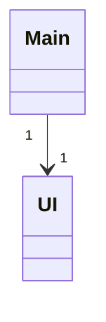

# Arkkitehtuurikuvaus

## Rakenne

Pakkaus _ui_ sisältää käyttöliittymästä.

## Käyttöliittymä

Käyttöliittymä sisältää yhden näkymän:

- Sudoku peli

Näkymä löytyy [UI](../src/ui/ui.py)-luokasta.

